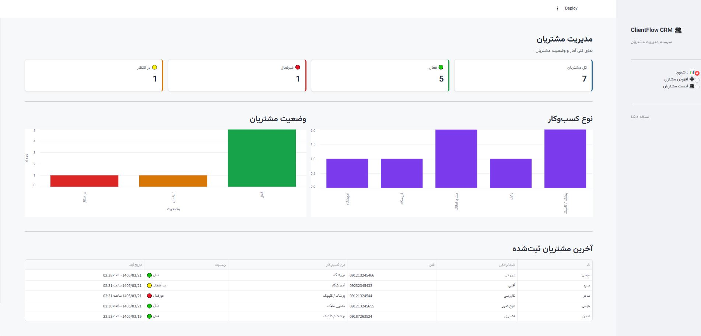
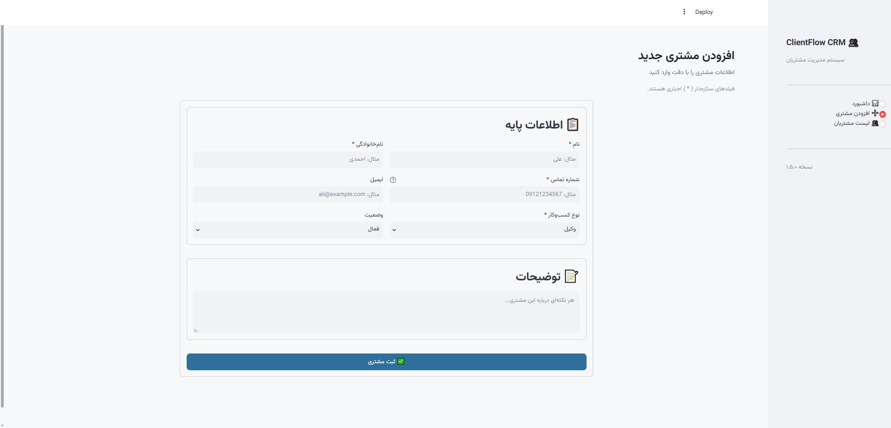
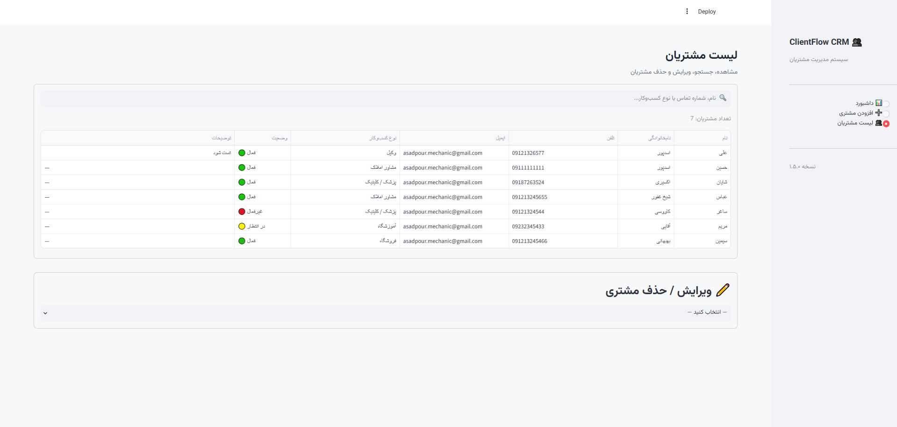

# 👥 ClientFlow CRM

سیستم ساده مدیریت مشتریان (CRM) با رابط کاربری کاملاً فارسی و راست‌چین (RTL)،
ساخته‌شده با Python و Streamlit.

این پروژه به‌عنوان یک نمونه‌کار (پورتفولیو) برای نمایش توانایی در توسعه
اپلیکیشن‌های داده‌محور با Streamlit، طراحی رابط کاربری فارسی، و معماری
تمیز و لایه‌بندی‌شده ساخته شده است.

---

## ✨ ویژگی‌ها

- ➕ افزودن مشتری جدید با اعتبارسنجی کامل فیلدها (نام فارسی، شماره تماس، ایمیل)
- 👥 مشاهده، جستجو، ویرایش و حذف مشتریان
- 📊 داشبورد آماری شامل:
  - کارت‌های آماری (کل مشتریان، فعال، غیرفعال، در انتظار)
  - نمودار توزیع مشتریان بر اساس نوع کسب‌وکار
  - نمودار توزیع وضعیت مشتریان
  - جدول آخرین مشتریان ثبت‌شده با تاریخ شمسی
- 🎨 رابط کاربری کاملاً فارسی و راست‌چین (RTL)
- 💾 ذخیره‌سازی ساده و سبک با فایل CSV (بدون نیاز به دیتابیس)

---

## 🛠 تکنولوژی‌ها

- **Python**
- **Streamlit** – فریم‌ورک ساخت رابط کاربری وب
- **Pandas** – پردازش و مدیریت داده‌ها
- **CSV** – ذخیره‌سازی داده (بدون دیتابیس)

---

## 📁 ساختار پروژه

```
ClientFlowCRM/
├── app.py                  # نقطه ورود، تنظیمات صفحه، CSS سراسری، سایدبار، روتینگ
├── requirements.txt         # وابستگی‌های پروژه
├── data/
│   └── clients.csv           # داده مشتریان
├── models/
│   └── client.py             # کلاس Client و گزینه‌های ثابت
├── services/
│   └── client_service.py     # منطق CRUD و آمار روی CSV
├── utils/
│   └── helpers.py             # توابع کمکی مشترک (اعتبارسنجی، فرمت تاریخ و...)
└── views/
    ├── add_client.py          # صفحه افزودن مشتری
    ├── client_list.py          # صفحه لیست/جستجو/ویرایش/حذف
    └── dashboard.py             # صفحه داشبورد
```

---

## 🚀 نحوه اجرا

۱. کلون کردن پروژه:

```bash
git clone https://github.com/USERNAME/ClientFlowCRM.git
cd ClientFlowCRM
```

۲. (اختیاری ولی توصیه‌شده) ساخت محیط مجازی:

```bash
python -m venv venv
venv\Scripts\activate   # ویندوز
```

۳. نصب وابستگی‌ها:

```bash
pip install -r requirements.txt
```

۴. اجرای برنامه:

```bash
streamlit run app.py
```

برنامه به‌صورت پیش‌فرض روی آدرس `http://localhost:8501` در دسترس خواهد بود.

---

## 📸 اسکرین‌شات‌ها

### داشبورد


### افزودن مشتری


### لیست مشتریان


---

## 👤 درباره توسعه‌دهنده

- نام: [نام شما]
- ایمیل: [ایمیل شما]
- لینکدین: [لینک پروفایل لینکدین]
- صفحه نمونه‌کارهای فریلنسری: [لینک پروفایل فریلنسری]

---

## 📄 لایسنس

این پروژه صرفاً برای اهداف نمایشی و نمونه‌کار ساخته شده است.
